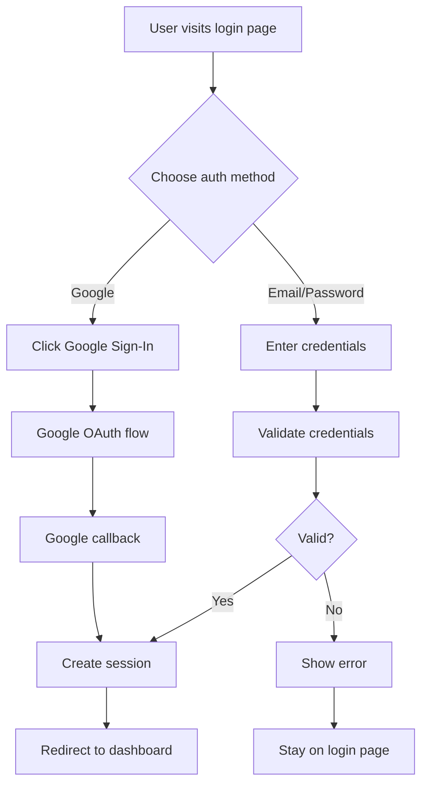

# Google Sign-In Implementation Documentation

## Table of Contents

1. [Overview](#overview)
2. [Prerequisites](#prerequisites)
3. [Environment Setup](#environment-setup)
4. [Implementation Details](#implementation-details)
5. [Components](#components)
6. [Authentication Flow](#authentication-flow)
7. [Usage Examples](#usage-examples)
8. [API Reference](#api-reference)
9. [Troubleshooting](#troubleshooting)
10. [Security Considerations](#security-considerations)

## Overview

This documentation covers the implementation of Google Sign-In functionality in the GeoSME Batangas application using NextAuth.js. The implementation supports both traditional email/password authentication and Google OAuth, with role-based access control for users and administrators.

### Features

- ✅ Google OAuth 2.0 integration
- ✅ Email/password authentication
- ✅ Role-based access control (User/Admin)
- ✅ Session management
- ✅ Form validation
- ✅ Loading states and error handling
- ✅ TypeScript support
- ✅ Responsive design

## Prerequisites

Before implementing Google Sign-In, ensure you have:

1. **Google Cloud Console Account**

   - Access to Google Cloud Console
   - Ability to create OAuth 2.0 credentials

2. **Next.js Application**

   - Next.js 13+ with App Router
   - TypeScript support

3. **Required Dependencies**
   ```bash
   npm install next-auth
   npm install @next-auth/prisma-adapter # if using Prisma
   ```

## Environment Setup

### 1. Google Cloud Console Setup

1. **Create a Google Cloud Project**

   - Go to [Google Cloud Console](https://console.cloud.google.com/)
   - Create a new project or select existing one

2. **Enable Google+ API**

   - Navigate to "APIs & Services" > "Library"
   - Search for "Google+ API" and enable it

3. **Create OAuth 2.0 Credentials**

   - Go to "APIs & Services" > "Credentials"
   - Click "Create Credentials" > "OAuth 2.0 Client IDs"
   - Choose "Web application"
   - Add authorized redirect URIs:
     ```
     http://localhost:3000/api/auth/callback/google
     https://yourdomain.com/api/auth/callback/google
     ```

4. **Copy Credentials**
   - Note down the Client ID and Client Secret

### 2. Environment Variables

Create or update your `.env.local` file:

```env
# Google OAuth
GOOGLE_CLIENT_ID=your_google_client_id_here
GOOGLE_CLIENT_SECRET=your_google_client_secret_here

# NextAuth Configuration
NEXTAUTH_SECRET=your_nextauth_secret_here
NEXTAUTH_URL=http://localhost:3000

# Database (if using)
DATABASE_URL=your_database_url_here
```

### 3. Generate NextAuth Secret

Generate a secure secret for NextAuth:

```bash
openssl rand -base64 32
```

## Implementation Details

### 1. Authentication Configuration (`lib/auth.ts`)

The main authentication configuration file that sets up providers and callbacks:

```typescript
import { NextAuthOptions } from "next-auth";
import GoogleProvider from "next-auth/providers/google";
import CredentialsProvider from "next-auth/providers/credentials";

export const authOptions: NextAuthOptions = {
  providers: [
    GoogleProvider({
      clientId: process.env.GOOGLE_CLIENT_ID || "",
      clientSecret: process.env.GOOGLE_CLIENT_SECRET || "",
    }),
    CredentialsProvider({
      name: "credentials",
      credentials: {
        email: { label: "Email", type: "email" },
        password: { label: "Password", type: "password" },
        username: { label: "Username", type: "text" },
      },
      async authorize(credentials) {
        // Custom validation logic here
      },
    }),
  ],
  callbacks: {
    async jwt({ token, user, account }) {
      // JWT token handling
    },
    async session({ session, token }) {
      // Session handling
    },
  },
  session: {
    strategy: "jwt",
  },
  secret: process.env.NEXTAUTH_SECRET,
};
```

### 2. TypeScript Extensions (`types/index.ts`)

Custom type definitions for NextAuth:

```typescript
declare module "next-auth" {
  interface User {
    id: string;
    role?: string;
  }

  interface Session {
    user: {
      id: string;
      name?: string | null;
      email?: string | null;
      image?: string | null;
      role: string;
    };
  }
}

declare module "next-auth/jwt" {
  interface JWT {
    id: string;
    role: string;
  }
}
```

### 3. Session Provider (`components/providers/SessionProvider.tsx`)

Wrapper component for NextAuth session management:

```typescript
"use client";

import { SessionProvider as NextAuthSessionProvider } from "next-auth/react";
import { ReactNode } from "react";

interface SessionProviderProps {
  children: ReactNode;
}

export function SessionProvider({ children }: SessionProviderProps) {
  return <NextAuthSessionProvider>{children}</NextAuthSessionProvider>;
}
```

## Components

### 1. Login Form (`components/main/ui/login-form.tsx`)

User login form with Google Sign-In support:

```typescript
"use client";

import { signIn } from "next-auth/react";
import { useState } from "react";
import { useRouter } from "next/navigation";

export function LoginForm() {
  const [email, setEmail] = useState("");
  const [password, setPassword] = useState("");
  const [isLoading, setIsLoading] = useState(false);
  const router = useRouter();

  const handleSubmit = async (e: React.FormEvent) => {
    e.preventDefault();
    setIsLoading(true);

    try {
      const result = await signIn("credentials", {
        email,
        password,
        redirect: false,
      });

      if (result?.error) {
        console.error("Login failed:", result.error);
      } else {
        router.push("/");
      }
    } catch (error) {
      console.error("Login error:", error);
    } finally {
      setIsLoading(false);
    }
  };

  const handleGoogleSignIn = async () => {
    setIsLoading(true);
    try {
      await signIn("google", { callbackUrl: "/" });
    } catch (error) {
      console.error("Google sign-in error:", error);
      setIsLoading(false);
    }
  };

  return (
    // Form JSX with Google Sign-In button
  );
}
```

### 2. Register Form (`components/main/ui/register-form.tsx`)

User registration form with validation and Google Sign-In:

```typescript
"use client";

import { signIn } from "next-auth/react";
import { useState } from "react";
import { useRouter } from "next/navigation";

export function RegisterForm() {
  const [formData, setFormData] = useState({
    fullName: "",
    email: "",
    password: "",
    confirmPassword: "",
  });
  const [errors, setErrors] = useState<Record<string, string>>({});

  const validateForm = () => {
    const newErrors: Record<string, string> = {};

    if (!formData.fullName.trim()) {
      newErrors.fullName = "Full name is required";
    }

    if (!formData.email.trim()) {
      newErrors.email = "Email is required";
    } else if (!/\S+@\S+\.\S+/.test(formData.email)) {
      newErrors.email = "Email is invalid";
    }

    if (!formData.password) {
      newErrors.password = "Password is required";
    } else if (formData.password.length < 6) {
      newErrors.password = "Password must be at least 6 characters";
    }

    if (formData.password !== formData.confirmPassword) {
      newErrors.confirmPassword = "Passwords do not match";
    }

    setErrors(newErrors);
    return Object.keys(newErrors).length === 0;
  };

  const handleGoogleSignIn = async () => {
    setIsLoading(true);
    try {
      await signIn("google", { callbackUrl: "/" });
    } catch (error) {
      console.error("Google sign-in error:", error);
      setIsLoading(false);
    }
  };

  return (
    // Form JSX with validation and Google Sign-In
  );
}
```

### 3. Admin Login Form (`components/admin/ui/login-form.tsx`)

Admin-specific login form:

```typescript
"use client";

import { signIn } from "next-auth/react";
import { useState } from "react";
import { useRouter } from "next/navigation";

export function LoginForm() {
  const [username, setUsername] = useState("");
  const [password, setPassword] = useState("");
  const [isLoading, setIsLoading] = useState(false);
  const router = useRouter();

  const handleSubmit = async (e: React.FormEvent) => {
    e.preventDefault();
    setIsLoading(true);

    try {
      const result = await signIn("credentials", {
        username,
        password,
        redirect: false,
      });

      if (result?.error) {
        console.error("Login failed:", result.error);
      } else {
        router.push("/admin");
      }
    } catch (error) {
      console.error("Login error:", error);
    } finally {
      setIsLoading(false);
    }
  };

  const handleGoogleSignIn = async () => {
    setIsLoading(true);
    try {
      await signIn("google", { callbackUrl: "/admin" });
    } catch (error) {
      console.error("Google sign-in error:", error);
      setIsLoading(false);
    }
  };

  return (
    // Admin form JSX
  );
}
```

### 4. Sign Out Button (`components/main/ui/SignOutButton.tsx`)

Reusable sign-out component:

```typescript
"use client";

import { signOut } from "next-auth/react";
import { Button } from "@/components/common";

interface SignOutButtonProps {
  className?: string;
  variant?: "default" | "outline" | "secondary" | "ghost" | "link";
}

export function SignOutButton({
  className,
  variant = "outline",
}: SignOutButtonProps) {
  const handleSignOut = async () => {
    await signOut({ callbackUrl: "/" });
  };

  return (
    <Button variant={variant} onClick={handleSignOut} className={className}>
      Sign Out
    </Button>
  );
}
```

## Authentication Flow

### 1. User Authentication Flow



### 2. Google OAuth Flow

1. **User clicks "Continue with Google"**
2. **Redirect to Google OAuth**
3. **User authorizes application**
4. **Google redirects back with code**
5. **NextAuth exchanges code for tokens**
6. **Create or update user in database**
7. **Generate JWT session**
8. **Redirect to callback URL**

### 3. Session Management

- **JWT Strategy**: Sessions are stored as JWTs
- **Automatic Refresh**: NextAuth handles token refresh
- **Role-based Access**: User roles are stored in JWT
- **Secure Storage**: Tokens are stored in HTTP-only cookies

## Usage Examples

### 1. Using the useAuth Hook

```typescript
"use client";

import { useAuth } from "@/hooks/use-auth";

export function UserProfile() {
  const { user, isAuthenticated, isLoading, isAdmin } = useAuth();

  if (isLoading) {
    return <div>Loading...</div>;
  }

  if (!isAuthenticated) {
    return <div>Please sign in</div>;
  }

  return (
    <div>
      <h1>Welcome, {user?.name}!</h1>
      <p>Email: {user?.email}</p>
      <p>Role: {user?.role}</p>
      {isAdmin && <p>Admin Dashboard</p>}
    </div>
  );
}
```

### 2. Protected Routes

```typescript
"use client";

import { useAuth } from "@/hooks/use-auth";
import { useRouter } from "next/navigation";
import { useEffect } from "react";

export function ProtectedComponent() {
  const { isAuthenticated, isLoading } = useAuth();
  const router = useRouter();

  useEffect(() => {
    if (!isLoading && !isAuthenticated) {
      router.push("/auth/user/login");
    }
  }, [isAuthenticated, isLoading, router]);

  if (isLoading) {
    return <div>Loading...</div>;
  }

  if (!isAuthenticated) {
    return null;
  }

  return <div>Protected content here</div>;
}
```

### 3. Admin-only Routes

```typescript
"use client";

import { useAuth } from "@/hooks/use-auth";
import { useRouter } from "next/navigation";
import { useEffect } from "react";

export function AdminComponent() {
  const { isAdmin, isLoading, isAuthenticated } = useAuth();
  const router = useRouter();

  useEffect(() => {
    if (!isLoading) {
      if (!isAuthenticated) {
        router.push("/auth/admin/login");
      } else if (!isAdmin) {
        router.push("/");
      }
    }
  }, [isAdmin, isLoading, isAuthenticated, router]);

  if (isLoading) {
    return <div>Loading...</div>;
  }

  if (!isAdmin) {
    return null;
  }

  return <div>Admin-only content</div>;
}
```

## API Reference

### NextAuth Functions

#### `signIn(provider, options)`

Sign in with a specific provider.

```typescript
import { signIn } from "next-auth/react";

// Google Sign-In
await signIn("google", { callbackUrl: "/dashboard" });

// Credentials Sign-In
await signIn("credentials", {
  email: "user@example.com",
  password: "password",
  redirect: false,
});
```

#### `signOut(options)`

Sign out the current user.

```typescript
import { signOut } from "next-auth/react";

await signOut({ callbackUrl: "/" });
```

#### `useSession()`

Hook to access session data.

```typescript
import { useSession } from "next-auth/react";

const { data: session, status } = useSession();
```

### Custom Hook: `useAuth()`

```typescript
const { user, isAuthenticated, isLoading, isAdmin, isUser } = useAuth();
```

**Returns:**

- `user`: Current user object or null
- `isAuthenticated`: Boolean indicating if user is signed in
- `isLoading`: Boolean indicating if auth state is loading
- `isAdmin`: Boolean indicating if user has admin role
- `isUser`: Boolean indicating if user has user role

## Troubleshooting

### Common Issues

#### 1. "Invalid redirect URI" Error

**Problem**: Google OAuth returns "Invalid redirect URI" error.

**Solution**:

- Check that redirect URI in Google Cloud Console matches exactly
- Ensure protocol (http/https) is correct
- Verify port numbers for local development

#### 2. "Missing Google OAuth credentials" Error

**Problem**: Application throws error about missing credentials.

**Solution**:

- Verify environment variables are set correctly
- Check that `.env.local` file exists
- Restart development server after adding environment variables

#### 3. Session Not Persisting

**Problem**: User session is lost on page refresh.

**Solution**:

- Ensure `SessionProvider` wraps the entire application
- Check that `NEXTAUTH_SECRET` is set
- Verify `NEXTAUTH_URL` is correct

#### 4. Google Sign-In Button Not Working

**Problem**: Google Sign-In button doesn't respond to clicks.

**Solution**:

- Check browser console for JavaScript errors
- Verify Google OAuth credentials are valid
- Ensure proper error handling in click handler

### Debug Mode

Enable NextAuth debug mode by adding to `.env.local`:

```env
NEXTAUTH_DEBUG=true
```

### Environment Variable Checklist

```env
# Required
GOOGLE_CLIENT_ID=your_client_id
GOOGLE_CLIENT_SECRET=your_client_secret
NEXTAUTH_SECRET=your_secret
NEXTAUTH_URL=http://localhost:3000

# Optional
NEXTAUTH_DEBUG=true
```

## Security Considerations

### 1. Environment Variables

- Never commit `.env.local` to version control
- Use strong, unique secrets for production
- Rotate secrets regularly

### 2. OAuth Configuration

- Use HTTPS in production
- Configure proper redirect URIs
- Limit OAuth scopes to minimum required

### 3. Session Security

- Use HTTP-only cookies
- Implement proper session timeout
- Validate user roles on server-side

### 4. Database Security

- Hash passwords before storing
- Use parameterized queries
- Implement rate limiting

### 5. Production Checklist

- [ ] Use HTTPS in production
- [ ] Set proper environment variables
- [ ] Configure Google OAuth for production domain
- [ ] Implement proper error handling
- [ ] Add logging for security events
- [ ] Set up monitoring and alerts

## Testing

### 1. Local Testing

```bash
# Start development server
npm run dev

# Test user login
http://localhost:3000/auth/user/login

# Test admin login
http://localhost:3000/auth/admin/login

# Test registration
http://localhost:3000/auth/user/register
```

### 2. Google OAuth Testing

- Use Google test accounts
- Test with different Google accounts
- Verify role assignment works correctly

### 3. Error Scenarios

- Test with invalid credentials
- Test network failures
- Test OAuth cancellation

## Maintenance

### Regular Tasks

1. **Monitor OAuth usage** in Google Cloud Console
2. **Review security logs** for suspicious activity
3. **Update dependencies** regularly
4. **Backup user data** and configurations
5. **Test authentication flows** after updates

### Updates

- Keep NextAuth.js updated
- Monitor Google OAuth API changes
- Update TypeScript types as needed
- Review and update security configurations

---

## Support

For issues related to this implementation:

1. Check the troubleshooting section above
2. Review NextAuth.js documentation
3. Check Google OAuth documentation
4. Review browser console for errors
5. Enable debug mode for detailed logging

## Resources

- [NextAuth.js Documentation](https://next-auth.js.org/)
- [Google OAuth 2.0 Documentation](https://developers.google.com/identity/protocols/oauth2)
- [Next.js Documentation](https://nextjs.org/docs)
- [TypeScript Documentation](https://www.typescriptlang.org/docs/)
